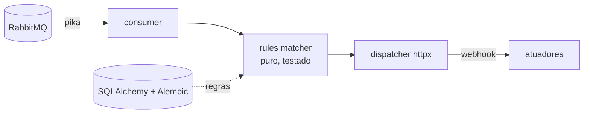

# rabbitmq-event-router

> **Daemon Python** que roteia eventos RabbitMQ para webhooks com regras em banco.

[](https://github.com/abreu0x/rabbitmq-event-router/actions)
[](https://github.com/abreu0x/rabbitmq-event-router/releases)
[](LICENSE)

> **Status:** esqueleto em desenvolvimento. A lógica de roteamento (modelo + matcher
> puro) já está testada com `ruff` + `mypy --strict` + cobertura 100% em CI. Consumo
> pika, persistência SQLAlchemy/Alembic, dispatch httpx e admin FastAPI chegam nas
> próximas etapas.

## 🚀 Demo em 30s

```bash
uv sync --all-extras
uv run pytest          # ruff + mypy + testes
```

```python
from rabbitmq_event_router import Event, RoutingRule, match_rules

rules = [
    RoutingRule(event_type="motion", webhook_url="https://hook/alarme", priority=10),
    RoutingRule(event_type="motion", webhook_url="https://hook/log", priority=1),
]
match_rules(Event(event_type="motion"), rules)
# → regras habilitadas que casam, ordenadas por prioridade
```

## 🏗️ Architecture



Camadas separadas de propósito: o **matcher de regras** é puro (sem broker, sem rede),
o que o torna testável em unidade + property tests (hypothesis) sem infra.

## 🧪 Testes & CI

| Camada | Ferramenta | Status |
|--------|-----------|--------|
| Estilo & tipos | `ruff` + `mypy --strict` | ✅ em CI |
| Unit + cobertura | `pytest` (≥ 80%) | ✅ 100% |
| Persistência | SQLAlchemy 2.0 + Alembic (SQLite in-mem) | ✅ load + migração testadas |
| Property-based | `hypothesis` no matcher | ✅ 3 invariantes |
| Integration | `testcontainers` (RabbitMQ efêmero) | ✅ publish→consume→route |
| Chaos | `toxiproxy` · mutation `mutmut` nightly | _planejado_ |

## 🗺️ Roadmap

- [x] Modelo de regras + matcher puro, testado (ruff/mypy/cov)
- [x] Consumer/publisher pika (ack manual + prefetch) + integration testcontainers
- [x] Persistência SQLAlchemy 2.0 + Alembic (migração testada) · property tests (hypothesis)
- [ ] Dispatcher httpx + DLX + retry exponencial · admin FastAPI
- [ ] Systemd unit · Docker Compose · chaos (toxiproxy) · mutmut nightly

## 🛠️ Stack

Python 3.12 · Pydantic 2 · pika · SQLAlchemy 2.0 · Alembic · FastAPI · httpx · structlog · pytest · ruff · mypy

## 📄 Licença

MIT — ver [LICENSE](LICENSE).
